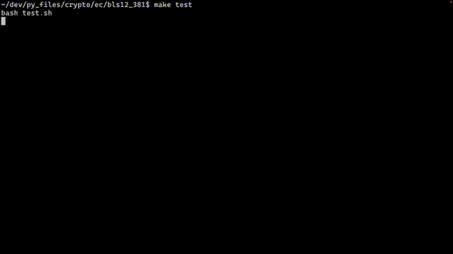

## ABOUT THIS
This is a hobby cryptograph library that is written in full scratch except for the standart library and TEST code.
it includes
- Elliptic Curve(BLS12-381)
- ElGamal Encryption on EC
- RSA Encryption
- Lagrange Interpolation on Elliptic Curve(BLS12-381)
- Homomorphic Encryption (RSA, ElGamal on EC)
- zk-proof on Elliptic Curve(BLS12-381)

## RUN
test.sh\
You can see the result of test in tmp.txt

- TEST

